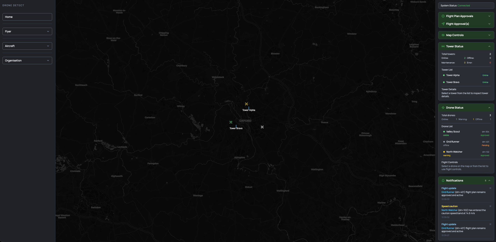

# Drone Detector POC

> Real-time drone tracking and flight management dashboard

Drone Detector is a React 19 SPA that renders a live drone operations view using OpenLayers for mapping, Zustand for state management, and a mock WebSocket simulator that can be swapped for a real backend via environment variables.

**[Live Demo →](https://dronedetect.netlify.app/)**

---

## Stack

| Layer | Library | Version |
|---|---|---|
| UI | React + TypeScript | 19 / 5.9 |
| Build | Vite | 7.1 |
| State | Zustand | 5.0 |
| Mapping | OpenLayers | 10.6 |
| Styling | Tailwind CSS + PostCSS | 3.4 / 8.5 |
| Testing | Vitest + Testing Library | 3.2 |
| Deploy | Netlify | — |

---

## Run Locally

```bash
npm install
npm run dev
```

Build for production:

```bash
npm run build
```

Run tests:

```bash
npm test
```

---

## Project Structure

```
src/
  App.tsx                      # Root layout, mounts WebSocket hook
  main.tsx                     # React 19 entry point
  components/
    ErrorBoundary.tsx          # Catches map errors, shows reload prompt
  features/
    layout/
      LeftSidebar.tsx          # Navigation shell (desktop only)
      RightRail.tsx            # Right panel container + connection badge
    map/
      MapContainer.tsx         # OpenLayers init, click handler, overlay, feature sync
      DronePopup.tsx           # Map-anchored popup card (shown on drone click)
      mapLayers.ts             # Drone feature sync + marker colour logic
      droneIcon.ts             # SVG drone icon generator (data-URL)
    panels/
      DroneStatusPanel.tsx     # Telemetry display for selected drone
      FlightApprovalPanel.tsx  # Full flight workflow UI
      NotificationPanel.tsx    # Live notification feed
  hooks/
    useDroneWebSocket.ts       # Routes WebSocket events to Zustand stores
  services/
    websocketClient.ts         # DroneSocketClient pub/sub event hub
    mockWsSimulator.ts         # Realistic tick-based drone telemetry generator
  store/
    droneStore.ts              # Drone positions, status, control overrides
    flightStore.ts             # Flight approval state machine
    notificationStore.ts       # Notification feed (max 30 items)
    uiStore.ts                 # Connection state
  types/
    drone.ts                   # Drone, FlightApproval, NotificationItem types
    websocket.ts               # Event envelope types and union
  utils/
    statusColors.ts            # Tailwind colour helpers for status values
  test/
    setup.ts                   # jest-dom matchers for Vitest
  styles/
    globals.css                # Tailwind directives + global resets
```

---

## Architecture

### Layout

Three-column desktop layout, stacks vertically on mobile:

```
┌─────────────┬────────────────────┬──────────────┐
│ LeftSidebar │    MapContainer    │  RightRail   │
│  (nav shell)│  (OpenLayers map)  │  (panels)    │
└─────────────┴────────────────────┴──────────────┘
```

- **LeftSidebar** — static navigation sections (Home, Flyer, Aircraft, Organisation); hidden below `lg` breakpoint.
- **MapContainer** — CartoDB Dark tile layer, vector overlay for drone markers. Centre: Oxford, UK (51.752°N, −1.258°W), zoom 11. Click selects a drone and opens a telemetry popup pinned above its icon; clicking empty map space closes it. Uses `startTransition()` to keep interactions responsive. Wrapped in an `ErrorBoundary` so a map crash doesn't break the rest of the UI.
- **RightRail** — stacks Drone Status, Flight Approval, and Notification panels. Shows WebSocket connection badge and a "Declare Emergency" button at the bottom.

### State Management

Four independent Zustand stores. Cross-store communication uses `.getState()` in async actions (not hooks).

#### `droneStore`
- `drones` — dict keyed by drone ID, updated on every WebSocket tick.
- `selectedDroneId` — currently inspected drone.
- `controlStatusByDrone` — per-drone operator overrides, persisted to `sessionStorage`.
- `upsertDrone()` — merges incoming telemetry; **ignores lat/lon, speed, and altitude updates while a drone is in a landed state** to prevent telemetry overriding an operator command.
- `setControlStatus()` — issues a land or takeoff command; immediately zeros altitude and speed on land.
- Includes a store migration to strip stale keys from old `sessionStorage` snapshots.

#### `flightStore`
- `approvals` — list of `FlightApproval` records. Initial state: drn-102 approved, drn-304 approved, drn-401 pending.
- `busyAction` — prevents concurrent commands while a simulated 900 ms network delay is in progress.
- State machine via `runAction()`:

| Action | Transition | Side effect |
|---|---|---|
| `request-approval` | pending / actionrequired → approved | — |
| `takeoff` | — | `setControlStatus("online")` |
| `land` | — | `setControlStatus("offline")` |
| `end-plan` | approved → pending | — |
| `view` | — | no-op |

#### `notificationStore`
- Holds up to 30 notifications, newest first. No persistence; cleared on page reload.

#### `uiStore`
- Single boolean `connected`, toggled by the WebSocket hook.

### Real-time Data Flow

```
mockWsSimulator.ts
  └─► DroneSocketClient (pub/sub, 1.2 s tick)
        └─► useDroneWebSocket (hook, mounted at App root)
              ├─► droneStore.upsertDrone()
              ├─► droneStore.updateDroneStatus()
              ├─► notificationStore.addNotification()
              └─► uiStore.setConnected()
```

Each tick drifts position (±200 m), speed (±1 m/s, min 3), altitude (±2 m, min 20), and heading (±9°). Status is set to `"warning"` if speed > 13.6 m/s, else `"online"`. There is a 28% chance per tick of generating a structured notification with `droneName` and `droneId` as separate fields (no regex parsing needed in the UI).

To connect a real backend, set `VITE_WS_URL` (see Environment below). The hook, stores, and event schema are already structured for a live API.

### WebSocket Event Envelope

```ts
{
  version: 1,
  type: "drone.position" | "drone.status" | "notification.created" | "connection.state",
  timestamp: string,
  payload: object
}
```

---

## Right Rail Panels

All panels share a collapsible design — dark green header bar with icon, title, and rotating chevron. Click the header to expand or collapse.

### Map Drone Popup

Clicking a drone marker opens a compact popup card pinned directly above the icon on the map:

- Moves with the drone in real time — position syncs on every 1.2 s telemetry tick via an OpenLayers `Overlay`.
- Header shows the drone name and an **×** close button.
- Body shows: ID, Speed (m/s), Altitude (m), Heading (°), and colour-coded Status.
- Closes via the × button (calls `selectDrone(null)` wrapped in `startTransition`) or by clicking empty map space.
- Clicking inside the popup does **not** propagate to the map (`stopEvent: true` on the Overlay).
- Implemented in `DronePopup.tsx` — a pure presentational component with no map or store dependencies.

### Drone Status

- **No drone selected** — shows the count of actively tracked drones and a prompt to select one on the map.
- **Drone selected** — shows the same live telemetry as the map popup: name, ID, speed (m/s), altitude (m), heading (°), and colour-coded status. Both the popup and this panel update together.

### Flight Approval

Two sections in one panel:

**Flight Plan Approvals** — always visible regardless of drone selection. Scrollable card list (~1.5 cards visible). Each card shows:
- Flight Plan ID + Aircraft ID
- Status (colour-coded)
- Plan start/end times
- Authority comments

**Flight Approval(s)** — drone-specific workflow section showing aircraft, approval status, flight status, and started time. Uses React 19 `useOptimistic()` for instant UI feedback — the status appears to update immediately while the 900 ms simulated delay resolves in the background. All buttons are disabled while `busyAction` is set.

| Condition | Available actions |
|---|---|
| Status `pending` or `actionrequired` | Request Approval |
| Status `approved`, drone on the ground | Take Off |
| Status `approved`, drone airborne | Land |
| Drone on the ground | End Flight |

### Notifications

- Scrollable feed (max 300 px), newest first.
- Each item is individually dismissable.
- Colour-coded by level: `info` (blue), `success` (green), `warning` (amber), `error` (red).
- Item count shown in the header when collapsed.
- Supports structured notifications (`droneName`/`droneId` fields) with regex fallback for legacy message formats.

---

## Flight Workflow (Per Drone)

1. Select a drone marker on the map.
2. If plan status is `pending` or `actionrequired`, use **Request Approval**.
3. Once approved, use **Take Off** / **Land** to toggle flight state.
4. Repeat Take Off / Land as needed while the plan remains `approved`.
5. **End Flight** resets the plan to `pending` (drone must be landed first).

---

## Map Marker Colours

Flight approval status takes priority over drone telemetry status:

| Condition | Colour |
|---|---|
| Flight plan `pending` | Amber |
| Flight plan `actionrequired` | Red |
| Drone status `online` | Cyan |
| Drone status `warning` | Amber |
| Drone status `offline` | Muted grey |

Selected drone renders with a larger icon (18 px → 24 px) and a distinct outline.

---

## Landed State Persistence

- Operator Land / Take Off commands are stored in `sessionStorage` via Zustand persist middleware, surviving page refresh.
- While landed: incoming telemetry position, speed, and altitude are ignored — the frozen values remain on the map.
- Take Off restores the drone to active flight (`"online"`); subsequent telemetry updates resume normally.
- Any drone with a `pending` plan starts in a landed state.

---

## Type System

### `src/types/drone.ts`

```ts
type DroneStatus = "online" | "warning" | "offline"

interface Drone {
  id: string; name: string;
  lat: number; lon: number;
  altitudeM: number; speedMps: number; headingDeg: number;
  updatedAt: string; status: DroneStatus;
}

type FlightApprovalStatus = "approved" | "pending" | "actionrequired" | "rejected"

interface FlightApproval {
  id: string; aircraftId: string; status: FlightApprovalStatus;
  startedAt: string | null; planStartedAt: string; comments: string;
}

type NotificationLevel = "info" | "success" | "warning" | "error"

interface NotificationItem {
  id: string; level: NotificationLevel;
  title: string; message: string;
  droneName?: string; droneId?: string;
  createdAt: string;
}
```

### `src/types/websocket.ts`

Typed event envelope with a discriminated union (`DroneSocketEvent`) covering all four event types. `DroneSocketClient` is fully typed against this union.

---

## Status Colour Helpers

`src/utils/statusColors.ts` exposes three pure functions returning Tailwind text-colour classes:

- `droneStatusColor(status)` — online → cyan, warning → amber, offline → muted
- `flightApprovalStatusColor(status)` — approved → cyan, pending → amber, actionrequired → red, rejected → muted
- `notificationLevelClass(level)` — warning → amber, error → red, success → green, info → blue

---

## Error Boundary

`ErrorBoundary` wraps `MapContainer`. If OpenLayers throws during render, the sidebar and right rail remain functional and the map area displays an error message with a "Reload Application" button.

---

## Testing

Tests are co-located with source files (`*.test.ts` / `*.test.tsx`). Coverage spans stores, services, the WebSocket hook, and panels.

```bash
npm test          # watch mode
npm run test:run  # single pass (CI)
```

Vitest runs in `jsdom` environment with globals enabled. `src/test/setup.ts` imports `@testing-library/jest-dom` for custom matchers.

---

## Environment Variables

Create a `.env` file (copy from `.env.example`):

```env
VITE_WS_MODE=mock           # "mock" uses the local simulator
VITE_WS_URL=ws://localhost:8080  # real backend WebSocket URL
```

Default behaviour without a `.env` file: mock simulator is used.

---

## Deployment

Deploys to Netlify out of the box.

| Setting | Value |
|---|---|
| Build command | `npm run build` |
| Publish directory | `dist` |
| Node version | 20 |

SPA routing (`/*` → `/index.html`) and security headers (`X-Frame-Options: DENY`, long-lived asset caching) are pre-configured in `netlify.toml`.

For step-by-step instructions see [DEPLOYMENT.md](DEPLOYMENT.md).

---

## Screenshot


